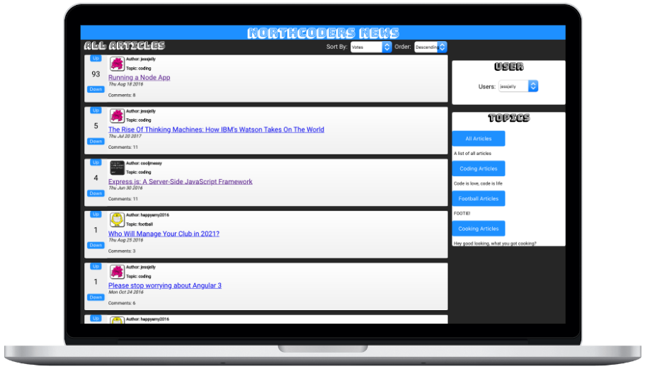

# Northcoders News Frontend Project

|               | Link                                                                                                       |
| ------------- | ---------------------------------------------------------------------------------------------------------- |
| Backend API   | [https://bt-nc-news.herokuapp.com/api](https://bt-nc-news.herokuapp.com/api)                               |
| Backend Repo  | [https://github.com/tben140/Northcoders-News-Backend](https://github.com/tben140/Northcoders-News-Backend) |
| Frontend Site | [https://bt-fe-nc-news.netlify.app](https://bt-fe-nc-news.netlify.app)                                     |



## Getting Started

To run the project, please clone this repository to a local folder, change directory into the repository, then install the required node modules the start the project with the bash commands below:

```bash
git clone https://github.com/tben140/Northcoders-News-Frontend.git

cd Northcoders-News-Frontend

npm install

npm start
```
